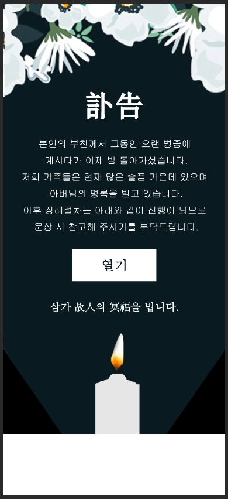
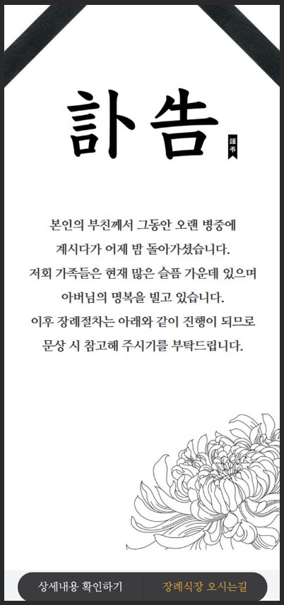
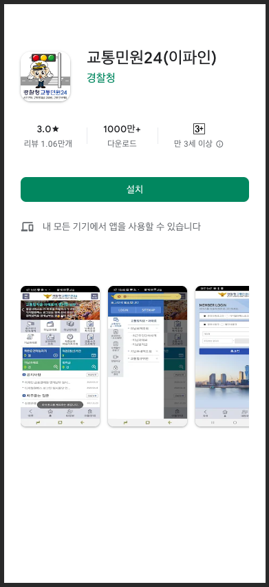
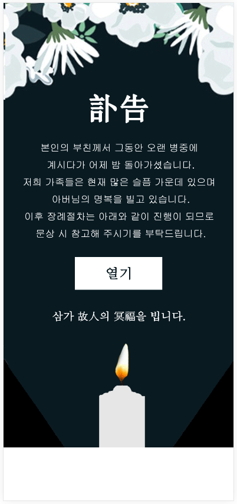

# 스미싱 범죄자들, 엿먹어주세요.

스미싱 범죄자들이 너무나도 악독해, 그들이 활용하는 링크와 수법을 공개적으로 기록합니다.
단, 이 레포에서는 한국인을 대상으로 하는 공격(사용자의 대다수가 한국인인 채널으로 공격하거나, 한국어로 번역이 되어 있는 링크를 배포하는 경우 등)에 대해서만 기록합니다.

제보할 정보가 있다면 이슈로 남겨주세요. 제보 시점에 해당 링크로 접속이 가능하거나, 웨이백 머신, 아카이브, 다량의 구글 크롤링 데이터 등으로 검증할 수 있어야 합니다.

아래에 기록되는 도메인 대부분은 서브도메인으로 접속하여도 동일한 스미싱 페이지가 출력됩니다.
다만 일부 도메인은 서브도메인을 허용하지 않거나 오히려 서브도메인만 허용하기도 하므로, 둘 중 하나만 허용되는 일부 케이스는 별도로 기록을 남겨두겠습니다.

## A

### appkorea.info
`초대장` `부고` `장례식` 
부고와 함께 장례식장 장소 및 시간을 확인하기 위해 앱을 설치하도록 하는 유형. 

  
이미지 보기

  

    
  

## B

### boramd.co.kr
> 2023-12-20 기준 스미싱 페이지는 `https://boramd.co.kr/cs` 으로 접속해야 출력되며, 
> 인덱스 페이지는 **실제 존재하는 병원**의 장례식장 웹사이트를 포워딩하고 있음.

`초대장` `부고` `부친` `병원` 
부고와 함께 장례식장 장소 및 시간을 확인하기 위해 앱을 설치하도록 하는 유형. 

  
이미지 보기

  

    
  

### bxxg3653.com
`초대장` `부고` `장례식` 
부고와 함께 장례식장 장소 및 시간을 확인하기 위해 앱을 설치하도록 하는 유형. 

  
이미지 보기

  

    
  

### bigsnua.com
`초대장` `부고` `장례식` 
부고와 함께 장례식장 장소 및 시간을 확인하기 위해 앱을 설치하도록 하는 유형. 

  
이미지 보기

  

    
  

## C

## D

## E

## F

## G

### govcms.xyz
> 2023-03-20 기준 특정 서브도메인 없이는 접속할 수 없습니다. 현재까지 파악된 서브도메인은 `wnb.govcms.xyz` 가 있습니다.

`정부` `정부24` 
폐기물관리법 위반 고지 확인을 위한 사기 웹사이트 접속을 유도하여 휴대전화 번호를 수집하는 유형. 

  
이미지 보기

  

    
  

### gunzhe.info
> 2023-04-13 기준 특정 서브도메인 없이는 접속할 수 없습니다. 현재까지 파악된 서브도메인은 `yid.gunzhe.info` 가 있습니다.

`정부` `정부24` 
폐기물관리법 위반 고지 확인을 위한 사기 웹사이트 접속을 유도하여 휴대전화 번호를 수집하는 유형. 

  
이미지 보기

  

    
  

## H

## I

### iconlive.store
`초대장` `부고` `장례식` 
부고와 함께 장례식장 장소 및 시간을 확인하기 위해 앱을 설치하도록 하는 유형. 

  
이미지 보기

  

    
  

## J

### joolakorea.com
`초대장` `부고` `장례식` 
부고와 함께 장례식장 장소 및 시간을 확인하기 위해 앱을 설치하도록 하는 유형. 

  
이미지 보기

  

    
  

## K

### koreaapk.com
`초대장` `부고` `장례식` 
부고와 함께 장례식장 장소 및 시간을 확인하기 위해 앱을 설치하도록 하는 유형. 

  
이미지 보기

  

    
  

### koreaboram.com (1)
> 2023-12-23 기준 다른 형태의 스미싱 페이지로 변경되었습니다. (2) 항목을 참고하세요.

`플레이스토어` `정부` `교통민원` 
플레이스토어와 그에 등록된 교통민원24 앱을 사칭하여 해킹 앱을 설치하도록 하는 유형. 

  
이미지 보기

  

    
  

### koreaboram.com (2)
`초대장` `부고` `장례식` 
부고와 함께 장례식장 장소 및 시간을 확인하기 위해 앱을 설치하도록 하는 유형. 

  
이미지 보기

  

    
  

## L

## M

### mangalife.com
`초대장` `부고` `장례식` 
부고와 함께 장례식장 장소 및 시간을 확인하기 위해 앱을 설치하도록 하는 유형. 

  
이미지 보기

  

    
  

### m-bugo.com
> 2023-12-20 기준 서브도메인 없이는 접속할 수 없습니다.

`초대장` `부고` `장례식` 
부고와 함께 장례식장 장소 및 시간을 확인하기 위해 앱을 설치하도록 하는 유형. 

  
이미지 보기

  

    
  

### meta-141678.pages.net.br
> `pages.net.br`은 브라질 기업 GreatSoftwares에서 운영하는 GreatPages가 제공하는 기본 도메인입니다.

`페이스북` 
페이스북 계정 보안 정책 등을 검토하기 위해 해당 링크로 접속을 유도하여 계정을 탈취하는 유형. 

  
이미지 보기

  

    
  

## N

### noond.kr
> 2023-12-20 기준 스미싱 페이지는 경로값(/foo 등)이 붙어야 출력됩니다.

`성인` `데이팅` 
자극적인 성인 이미지를 보여주며 매칭을 위해 앱을 설치하도록 하는 유형. 
*백신 솔루션이 해당 앱을 오판하는 문제가 있으나 정상적인 앱이라는 문구를 출력*하는 등의 안내 메시지를 출력함.

  
이미지 보기 (성인컨텐츠 모자이크됨)

  

    
  

## O

## P

### preslhouse.com
`초대장` `부고` `장례식` 
부고와 함께 장례식장 장소 및 시간을 확인하기 위해 앱을 설치하도록 하는 유형. 

  
이미지 보기

  

    
  

## Q

## R

## S

### samga.store
> 2023-01-15 기준 특정 서브도메인 없이는 접속할 수 없습니다. 현재까지 파악된 서브도메인은 `daam.samga.store` 가 있습니다.

`초대장` `부고` `장례식` 
부고와 함께 장례식장 장소 및 시간을 확인하기 위해 앱을 설치하도록 하는 유형. 

  
이미지 보기

  

    
  

### skymgd.com
`초대장` `부고` `장례식` 
부고와 함께 장례식장 장소 및 시간을 확인하기 위해 앱을 설치하도록 하는 유형. 

  
이미지 보기

  

    
  

### samgabugo.com
> 2023-04-01 기준 특정 서브도메인 없이는 접속할 수 없습니다. 현재까지 파악된 서브도메인은 `cards.samgabugo.com`, `appsko.samgabugo.com`, `bugom.samgabugo.com` 가 있습니다.

`안드로이드` `초대장` `부고` `장례식` 
**안드로이드가 아닌 플랫폼(PC, 맥, iOS 등)에서는 접속되지 않도록 하는 기능을 포함함.** 
부고와 함께 장례식장 장소 및 시간을 확인하기 위해 앱을 설치하도록 하는 유형. 

  
이미지 보기

  

    
  

## T

## U

### u0su.one
`정부` `교통민원` 
과태료, 범칙금 통지서를 확인하기 위해 앱을 설치하도록 하는 유형. 

  
이미지 보기

  

    
  

## V

## W

## X

## Y

## Z
